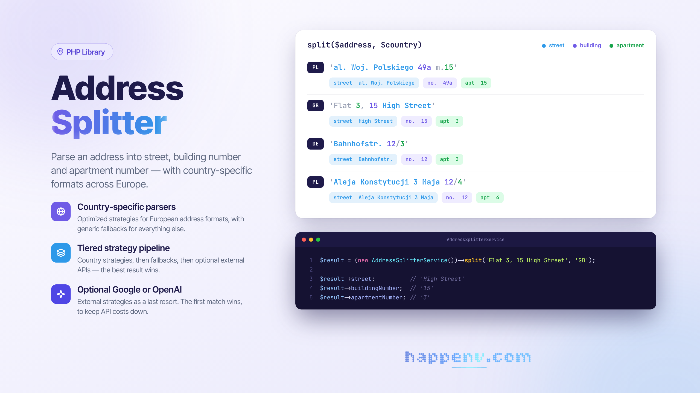

# Address Splitter

<div class="filament-hidden">



</div>

A PHP library for parsing addresses into components: street, building number, and apartment number.

Supports country-specific address formats for 29 European countries and includes generic fallback strategies for unknown formats.

## Installation

```bash
composer require happenv-com/address-splitter
```

**Requirements:** PHP 8.0+

## Quick Start

```php
use Happenv\AddressSplitter\AddressSplitterService;

$splitter = new AddressSplitterService();

// Parse a Polish address
$result = $splitter->split('ul. Marszałkowska 123/45', 'PL');

echo $result->street;           // "Marszałkowska"
echo $result->buildingNumber;   // "123"
echo $result->apartmentNumber;  // "45"

// Parse without country code (uses fallback strategies)
$result = $splitter->split('Baker Street 221B');

echo $result->street;           // "Baker Street"
echo $result->buildingNumber;   // "221B"
```

## Parse Result

The `split()` method returns a `ParsedAddress` object:

```php
final readonly class ParsedAddress
{
    public string $street;
    public ?string $buildingNumber;
    public ?string $apartmentNumber;
}
```

If no strategy matches the address, the entire text is returned as `street`.

## Supported Countries

The library includes optimized parsers for the following countries:

| Code | Country | Example Formats |
|------|---------|-----------------|
| `PL` | Poland | `ul. Marszałkowska 123/45`, `al. Jana Pawła II 15`, `3 Maja 10` |
| `DE` | Germany | `Hauptstraße 42a`, `Musterweg 12-14` |
| `AT` | Austria | `Ringstraße 15/3`, `Hauptplatz 1` |
| `CH` | Switzerland | `Bahnhofstrasse 10`, `Rue de Lausanne 25` |
| `FR` | France | `15 Rue de la Paix`, `25 bis Avenue des Champs-Élysées` |
| `BE` | Belgium | `Rue Haute 120`, `Hoogstraat 45` |
| `LU` | Luxembourg | `12 Avenue de la Liberté` |
| `NL` | Netherlands | `Kalverstraat 152-III`, `1e Helmersstraat 25` |
| `GB` | United Kingdom | `221B Baker Street`, `Flat 5, 10 Downing Street` |
| `IE` | Ireland | `42 O'Connell Street Upper` |
| `IT` | Italy | `Via Roma 15/A`, `Piazza Duomo 1` |
| `ES` | Spain | `Calle Mayor 25, 3º B`, `Avenida de la Constitución 10` |
| `PT` | Portugal | `Rua Augusta 100, 2º Esq`, `Avenida da Liberdade 50` |
| `SE` | Sweden | `Kungsgatan 44, 2 tr`, `Storgatan 12 lgh 1001` |
| `FI` | Finland | `Mannerheimintie 5 A 12`, `Aleksanterinkatu 10` |
| `DK` | Denmark | `Strøget 15, 2. sal`, `Vesterbrogade 100` |
| `CZ` | Czech Republic | `Václavské náměstí 123/45`, `Karlova 10` |
| `SK` | Slovakia | `Hlavná 50/12`, `Obchodná 15` |
| `HU` | Hungary | `Andrássy út 60. 3/5`, `Váci utca 12` |
| `LT` | Lithuania | `Gedimino pr. 15-20`, `Vilniaus g. 25` |
| `LV` | Latvia | `Brīvības iela 100-5`, `Rīgas iela 12` |
| `EE` | Estonia | `Viru tänav 15-3`, `Tartu mnt 50` |
| `RO` | Romania | `Strada Victoriei nr. 10, ap. 5`, `Bulevardul Unirii 25` |
| `BG` | Bulgaria | `бул. Витоша 15, ап. 3`, `ул. Шипка 10` |
| `HR` | Croatia | `Ilica 25/3`, `Trg bana Jelačića 10` |
| `SI` | Slovenia | `Slovenska cesta 50/2`, `Prešernov trg 5` |
| `GR` | Greece | `Λεωφόρος Αθηνών 100`, `Οδός Ερμού 25` |
| `MT` | Malta | `15 Republic Street`, `Flat 3, 20 Main Street` |
| `CY` | Cyprus | `25 Makarios Avenue`, `10 Ledra Street` |

## Configuration

### Default Configuration

```php
use Happenv\AddressSplitter\AddressSplitterService;
use Happenv\AddressSplitter\AddressSplitterConfiguration;

// Use default configuration (all countries)
$splitter = new AddressSplitterService();

// Explicitly use default configuration
$splitter = new AddressSplitterService(
    AddressSplitterConfiguration::default()
);
```

### Empty Configuration

```php
// Start from empty configuration
$config = AddressSplitterConfiguration::empty();

$splitter = new AddressSplitterService($config);
```

### Adding Strategies

```php
use Happenv\AddressSplitter\AddressSplitterConfiguration;
use Happenv\AddressSplitter\Parsers\PolandParser\GenericPolishStrategy;
use Happenv\AddressSplitter\Parsers\PolandParser\PrefixedStreetStrategy;

$config = AddressSplitterConfiguration::default()
    // Add strategy at the end (lower priority)
    ->append('PL', [new MyCustomPolishStrategy()])
    
    // Add strategy at the beginning (higher priority)
    ->prepend('PL', [new MyHighPriorityStrategy()]);
```

### Custom Fallback Strategies

Fallback strategies are used when:
- No country code is provided
- No strategies are defined for the given country

```php
use Happenv\AddressSplitter\GenericParsers\NumberFirstStrategy;
use Happenv\AddressSplitter\GenericParsers\StreetFirstStrategy;

$config = AddressSplitterConfiguration::default()
    ->withFallbackStrategies([
        new NumberFirstStrategy(),
        new StreetFirstStrategy(),
    ]);
```

Default fallback strategies:
- `SlashApartmentStrategy` - formats with `/` as apartment separator
- `CommaApartmentStrategy` - formats with `,` as separator
- `DashApartmentStrategy` - formats with `-` as separator
- `StreetFirstStrategy` - street before number
- `NumberFirstStrategy` - number before street

## External Strategies (API)

For addresses that cannot be parsed by local strategies, you can enable external APIs.

**Important:** External strategies use "first match wins" logic - the first strategy that returns a result wins. This prevents unnecessary API costs.

### Google Address Validation API

```php
use Happenv\AddressSplitter\AddressSplitterConfiguration;
use Happenv\AddressSplitter\ExternalParsers\GoogleAddressValidationStrategy;
use Happenv\AddressSplitter\Http\GuzzleHttpClient;

$googleStrategy = new GoogleAddressValidationStrategy(
    httpClient: new GuzzleHttpClient(),
    apiKey: 'YOUR_GOOGLE_API_KEY',
    regionCode: 'PL', // optional - region hint
);

$config = AddressSplitterConfiguration::default()
    ->withExternalStrategies([$googleStrategy]);

$splitter = new AddressSplitterService($config);
```

### OpenAI API

```php
use Happenv\AddressSplitter\ExternalParsers\OpenAiAddressParsingStrategy;
use Happenv\AddressSplitter\Http\CurlHttpClient;

$openAiStrategy = new OpenAiAddressParsingStrategy(
    httpClient: new CurlHttpClient(),
    apiKey: 'YOUR_OPENAI_API_KEY',
    model: 'gpt-4o-mini', // optional, defaults to gpt-4o-mini
    countryHint: 'Poland', // optional - country hint
);

$config = AddressSplitterConfiguration::default()
    ->withExternalStrategies([$openAiStrategy]);
```

### Multiple External Strategies

```php
$config = AddressSplitterConfiguration::default()
    ->withExternalStrategies([
        $googleStrategy,  // checked first
        $openAiStrategy,  // checked only if Google returns no result
    ]);
```

### Enabling/Disabling External Strategies

```php
$config = AddressSplitterConfiguration::default()
    ->withExternalStrategies([$googleStrategy])
    ->disableExternalStrategies(); // temporarily disable

// Later...
$config->enableExternalStrategies();
```

## Custom Parsing Strategies

You can create custom strategies by implementing the `AddressParsingStrategyInterface`:

```php
use Happenv\AddressSplitter\Dto\ParsedAddress;
use Happenv\AddressSplitter\Contracts\AddressParsingStrategyInterface;
use Happenv\AddressSplitter\Exceptions\CannotParseAddressException;

final class MyCustomStrategy implements AddressParsingStrategyInterface
{
    public function parse(string $address): ParsedAddress
    {
        // Attempt to match the address
        if (preg_match('/^(.+)\s+(\d+[a-z]?)$/i', $address, $matches)) {
            return new ParsedAddress(
                street: $matches[1],
                buildingNumber: $matches[2],
            );
        }

        // Throw exception if unable to parse
        throw new CannotParseAddressException($address);
    }
}
```

Or extend the `AbstractParsingStrategy` class:

```php
use Happenv\AddressSplitter\Parsers\AbstractParsingStrategy;
use Happenv\AddressSplitter\Dto\ParsedAddress;

final class MyRegexStrategy extends AbstractParsingStrategy
{
    protected function getPatterns(): array
    {
        return [
            '/^(?<street>.+)\s+(?<buildingNumber>\d+[a-z]?)(?:\/(?<apartmentNumber>\d+))?$/iu',
        ];
    }
}
```

## HTTP Clients

The library provides two HTTP clients for external strategies:

### CurlHttpClient

Native PHP client with no external dependencies:

```php
use Happenv\AddressSplitter\Http\CurlHttpClient;

$client = new CurlHttpClient();
```

### GuzzleHttpClient

Wrapper for Guzzle HTTP (requires `guzzlehttp/guzzle`):

```php
use Happenv\AddressSplitter\Http\GuzzleHttpClient;
use GuzzleHttp\Client;

// With default client
$client = new GuzzleHttpClient();

// With custom Guzzle client
$client = new GuzzleHttpClient(new Client([
    'timeout' => 5.0,
]));
```

### Custom HTTP Client

Implement `HttpClientInterface`:

```php
use Happenv\AddressSplitter\Contracts\HttpClientInterface;

final class MyHttpClient implements HttpClientInterface
{
    public function post(string $url, array $options = []): array
    {
        // Your implementation
    }
}
```

## Architecture

The library uses a three-tier parsing strategy:

1. **Country strategies** - country-specific parsers (all results → `BestResultSelector`)
2. **Fallback strategies** - generic parsers when no country code (all results → `BestResultSelector`)
3. **External strategies** - paid APIs (first match wins - cost minimization)

```
Input Address
       ↓
┌──────────────────────────────────────────┐
│  1. Country strategies (if country code) │
│     → Collect all results                │
│     → BestResultSelector picks the best  │
└──────────────────────────────────────────┘
       ↓ (no result)
┌──────────────────────────────────────────┐
│  2. Fallback strategies                  │
│     → Collect all results                │
│     → BestResultSelector picks the best  │
└──────────────────────────────────────────┘
       ↓ (no result)
┌──────────────────────────────────────────┐
│  3. External strategies (optional)       │
│     → First result wins                  │
│     → Minimizes API calls                │
└──────────────────────────────────────────┘
       ↓ (no result)
┌──────────────────────────────────────────┐
│  4. Fallback: entire address as street   │
└──────────────────────────────────────────┘
```

## Testing

```bash
composer test
```

## License

MIT License
